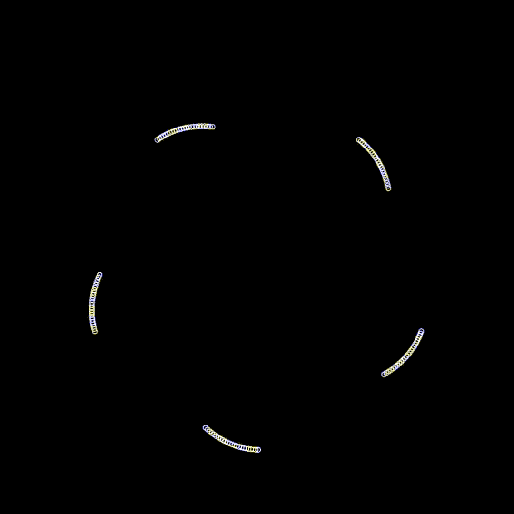
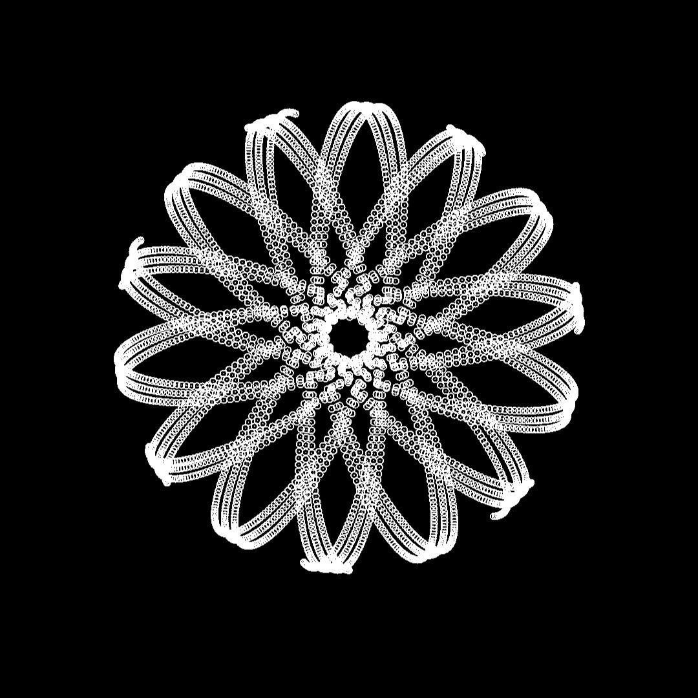
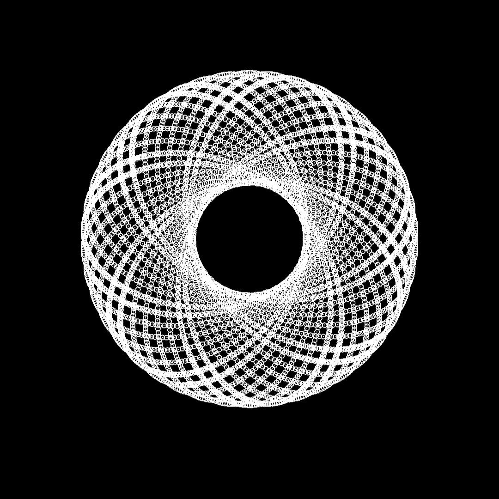
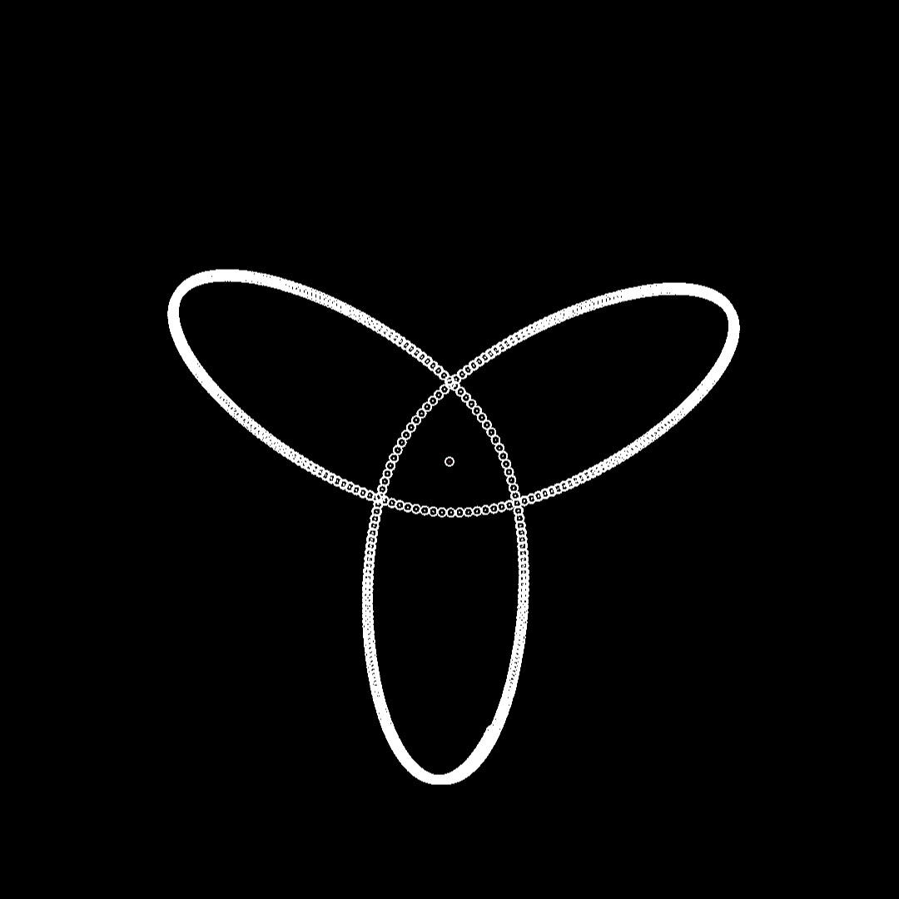
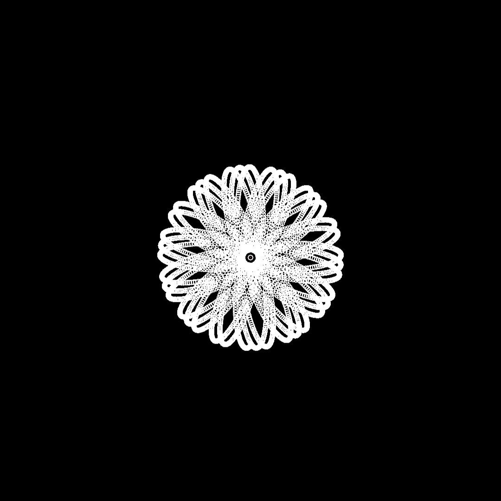
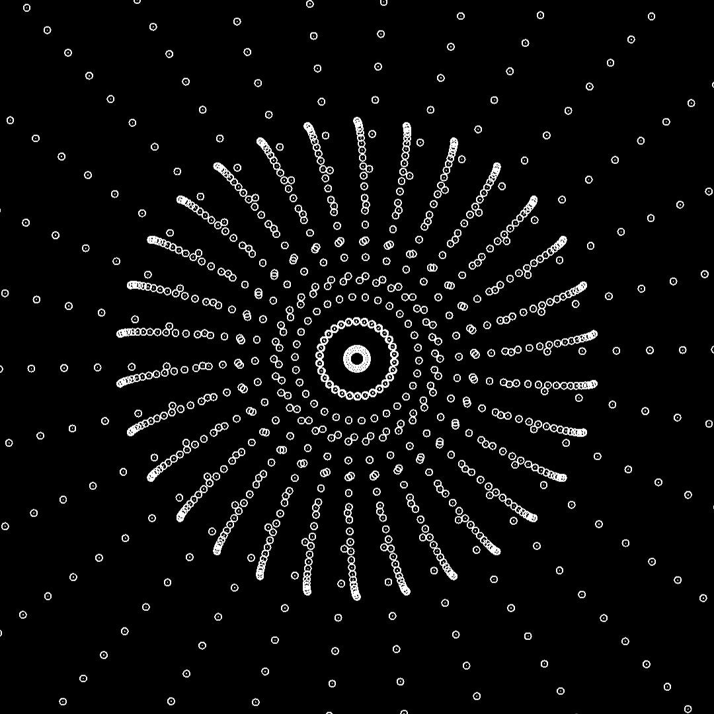
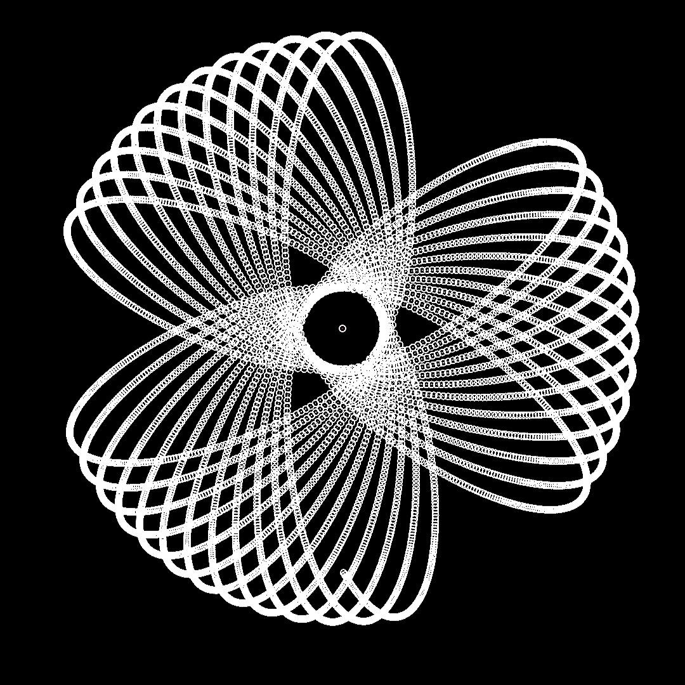
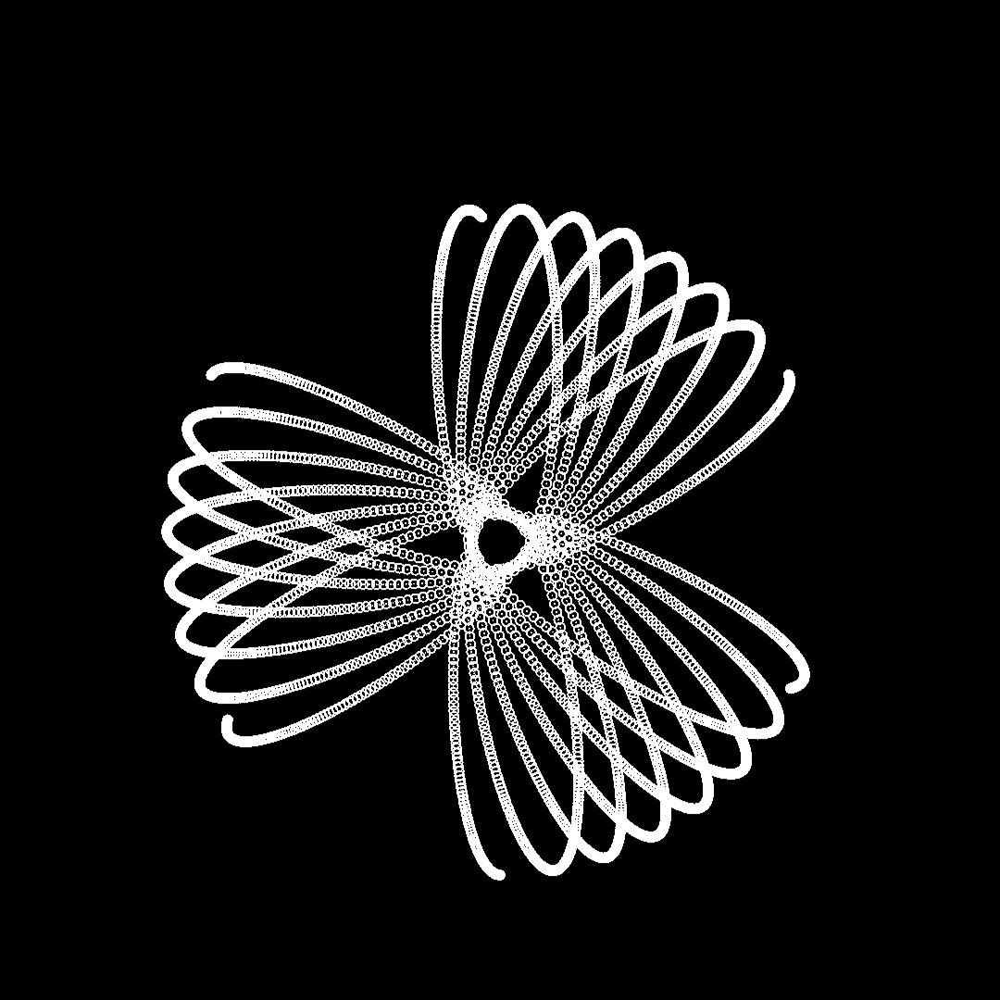
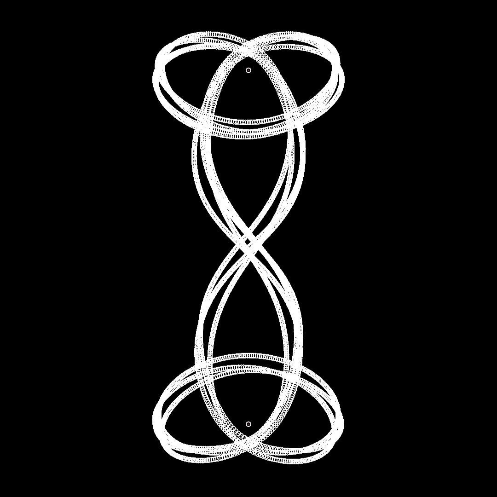

## What is this about?
This small project of mine emerged out of boredom, when I started trying to code a gravity simulation on my phone. 
Using Android Processing and APDE, I was able to create a small but nice program for simulating gravity with stationary objects, dynamic objects and 
finger touch by the user. Every single object has the same mass, dynamic objects do have changing velocity and figer touch objects are only temporary.
Whilst experimenting, interesiting orbital patterns started to emerge. Especially, when multiple dynamic objects were arranged in a symmetric way, they would
form beautiful repetitive patterns. I have automated this process of arrranging the n dynamic objects into a n-polgonic shape and giving them a initial direction of 
the tangent of the circle which traverses every corner of the n-polygon. You can configure the initial velocity / offset angle from the tangent at the top of the code :)

## Gallery
Here is a small portion of interesting pattern that emerged during different configurations

